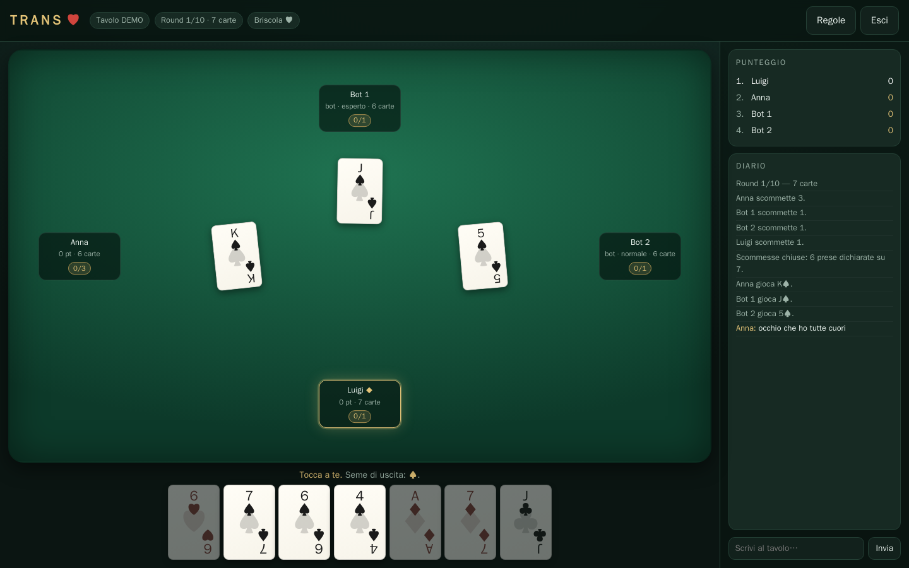
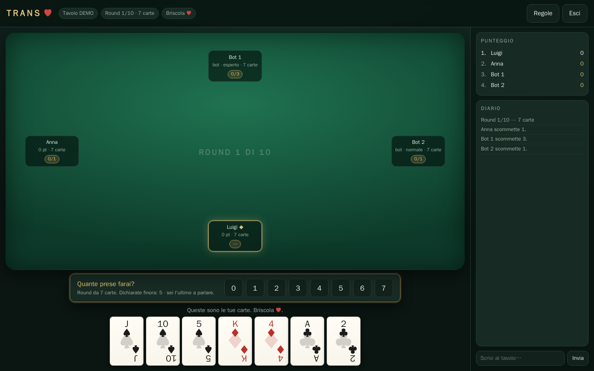

# TRANS

[](https://github.com/dantonioluigi/trans-card-game/actions/workflows/ci.yml)
[](https://github.com/dantonioluigi/trans-card-game/actions/workflows/release.yml)

Gioco di carte a **prese e dichiarazioni**: una via di mezzo fra briscola e tresette,
dove il punto non è prendere tanto, ma prendere **esattamente quanto avevi detto**.

Multiplayer online (basta un link) oppure da soli contro i bot. Niente account,
niente installazioni per chi gioca: si apre il browser e si entra con un codice a 4 lettere.

### 🎴 [Si gioca qui →](https://dantonioluigi.github.io/trans-card-game/)

Quella è la versione **senza server**: apri una stanza, passi il link, e le carte
viaggiano da browser a browser. Se invece vuoi ospitarti la partita per conto tuo,
nel repo c'è il server Python completo — vedi [Dove farlo girare](#dove-farlo-girare).



---

## Le regole

**Il mazzo.** 52 carte francesi, niente jolly.
Valori: `2 < 3 < … < 10 < J < Q < K < A`. La **briscola è sempre cuori ♥**.

**La presa.** Chi esce sceglie il seme. Sei **obbligato a rispondere a quel seme** se
ce l'hai in mano; se non ce l'hai giochi quello che vuoi, briscola compresa.
Vince la briscola più alta, altrimenti la carta più alta del seme di uscita.
Chi prende esce nella presa successiva.

**Chi arriva tardi.** Per iniziare servono almeno due giocatori, quindi spesso si
parte con dei bot. Chi entra col codice a partita già cominciata **prende il posto
di un bot**, con le sue carte e il suo punteggio: nessuno resta fuori per aver
tardato, e chi ospita non deve restare fermo ad aspettare.

**La dichiarazione.** Prima di giocare ognuno dichiara quante prese farà,
partendo da sinistra del mazziere — che quindi parla per ultimo.

**Il mazziere non può pareggiare il conto:** la somma delle dichiarazioni non
può fare esattamente il numero di prese in palio. In cinque, in un round da 5
carte, se i primi quattro dicono 1 a testa il mazziere non può dire 1: dovrà
dire 0, oppure 2 o più. Così almeno un giocatore sbaglia per forza, e chiudere
il giro diventa la posizione più scomoda del tavolo.

| Esito | Punti |
|---|---|
| Dichiari **0** e fai **0** | **10** |
| Dichiari **1** e fai **1** | **15** |
| Dichiari **2** e fai **2** | **20** |
| … e così via, +5 per ogni presa dichiarata | `10 + 5 × dichiarate` |
| **Sbagli** la dichiarazione | **1 punto per ogni presa fatta** |

Dichiarare tanto paga, ma sbagliare di una sola presa azzera quasi tutto: dire 4 e
farne 4 vale 30, dire 4 e farne 3 ne vale 3.



Si dichiara guardando le proprie carte — tranne nel round BUIO, dove restano coperte.

**I round.** Si scende di mano in mano — 7 carte a testa, poi 6, 5, 4, 3, 2, 1 —
e poi arrivano i tre round speciali, tutti da 7 carte:

| Round | Cosa cambia |
|---|---|
| **NO BRISCOLA** | Non c'è briscola. Vince sempre la carta più alta del seme di uscita. |
| **BUIO** | Dichiari **senza guardare le tue carte**. Le vedi solo dopo che hanno parlato tutti. |
| **A PERDERE** | Non si dichiara: ogni presa che incassi vale **−5 punti**. |

**Durata.**

- **Partita veloce — 10 round:** `7, 6, 5, 4, 3, 2, 1` + NO BRISCOLA, BUIO, A PERDERE.
- **Partita lunga — 20 round:** la veloce, poi la risalita `1, 2, 3, 4, 5, 6, 7`
  e di nuovo i tre speciali.

Vince chi ha più punti alla fine. Si gioca da **2 a 6 giocatori**, umani o bot mescolati.

---

## Come si avvia

```bash
git clone https://github.com/<utente>/trans-card-game.git
cd trans-card-game
pip install -r requirements.txt
python -m server.main
```

Apri <http://localhost:8000>, scegli un nome e **Crea tavolo**: ti ritrovi un codice
a 4 lettere. Passalo agli altri (o usa *copia il link d'invito*), riempi i posti
vuoti con i bot e parti.

Variabili d'ambiente utili:

| Variabile | Default | A cosa serve |
|---|---|---|
| `TRANS_HOST` | `0.0.0.0` | interfaccia di ascolto |
| `TRANS_PORT` | `8000` | porta |
| `TRANS_RELOAD` | *(vuoto)* | se valorizzata, ricarica a caldo durante lo sviluppo |

Con Docker:

```bash
docker build -t trans .
docker run --rm -p 8000:8000 trans
```

---

## Dove farlo girare

Ci sono due modi di far girare TRANS, e fanno cose diverse.

### Senza server, su GitHub Pages

È la versione pubblicata: motore, regole e bot girano **dentro il browser**, e
i giocatori si collegano fra loro in WebRTC. Chi apre la stanza fa da arbitro
per tutti; il link contiene il codice del tavolo. Nessun processo da tenere
acceso, nessun costo.

Due cose che non sono gratis, e vanno sapute:

- **Chi apre la stanza deve restare collegato.** Se chiude la scheda, la partita
  finisce per tutti. Non c'è nessun altro che tenga lo stato.
- **Serve un intermediario per la presentazione fra i browser.** TRANS usa il
  broker pubblico di PeerJS. Se è giù, o se la rete che stai usando blocca quel
  tipo di collegamento (capita in azienda), il gioco lo dice entro dodici
  secondi invece di restare lì. In quel caso puoi puntare a un broker tuo:
  `?broker=https://tuo-broker` nell'indirizzo, e
  [peerjs-server](https://github.com/peers/peerjs-server) è un container da due
  righe.
- **Il browser dell'host conosce le carte di tutti.** La UI non gliele mostra,
  ma sono nella memoria della sua pagina: chi sa aprire la console può
  guardarle. Fra amici è irrilevante; non è a prova di baro come il server.

Serve comunque un intermediario per la presentazione fra i browser — due
computer non si trovano da soli. TRANS usa il broker pubblico di PeerJS, che
vede solo la stretta di mano: le carte poi viaggiano dirette.

### Con il server Python

Se le due limitazioni sopra danno fastidio — partite lunghe, gente che entra e
esce, o semplicemente non fidarsi — il server è l'opzione seria: tiene lui lo
stato, nessuno vede le carte degli altri, e chi si disconnette ritrova il suo
posto rientrando.

Serve un posto che tenga acceso un processo Python e lasci passare i WebSocket.
Il vincolo che decide tutto è **una sola istanza**: i tavoli vivono nella
memoria del processo, quindi due repliche dietro lo stesso indirizzo sono due
partite scollegate. Niente autoscaling, o sessioni sticky se proprio serve.

| Dove | Come | Da sapere |
|---|---|---|
| **Fly.io** | `fly deploy --config deploy/fly.toml` | La scelta più semplice: gira l'immagine Docker così com'è. [`deploy/fly.toml`](deploy/fly.toml) tiene la macchina sempre accesa (`auto_stop_machines = false`) perché spegnerla cancella le partite in corso. Ricordati `fly scale count 1`. |
| **Render** | Blueprint da [`render.yaml`](render.yaml) | **Il più simile a GitHub Pages:** colleghi il repo, ogni push ridistribuisce, l'URL è gratuito. Sul piano free però il servizio si spegne dopo ~15 minuti di inattività e il risveglio richiede una trentina di secondi. |
| **Un VPS** | [`deploy/docker-compose.yml`](deploy/docker-compose.yml) | Cinque euro al mese di Hetzner o simili e non ci pensi più. Metti un reverse proxy davanti (Caddy fa HTTPS da solo) e alza i timeout, se no taglia i WebSocket. |
| **Kubernetes** | il chart in [`helm/`](helm/trans-card-game/) | Se ne hai già uno. Il chart è già impostato per una replica sola. |
| **Cloud Run** | `gcloud run deploy` | Funziona, ma va messo `--max-instances=1 --min-instances=1`: con lo scale-to-zero di default le partite muoiono, e con più istanze si sdoppiano. |
| **Solo per una sera** | `cloudflared tunnel --url http://localhost:8000` | Il server gira sul tuo PC e ottieni un indirizzo pubblico temporaneo da mandare agli amici. Zero hosting. |
| **GitHub Pages** | workflow [`pages.yml`](.github/workflows/pages.yml) | Gratis e già attivo, ma è la versione peer-to-peer descritta sopra: il server Python non ci gira. |

### Il più vicino a GitHub Pages: Render

Se quello che cerchi è esattamente l'esperienza di Pages — colleghi il repo,
pushi, il sito è online e non paghi — la risposta è Render:

1. Vai su [render.com](https://render.com) e collega l'account GitHub.
2. **New → Blueprint**, scegli `trans-card-game`, **Apply**. Il file
   [`render.yaml`](render.yaml) in radice dice già tutto: build da `Dockerfile`,
   health check su `/health`, piano free.
3. Dopo qualche minuto ti trovi l'indirizzo `https://trans-card-game.onrender.com`
   (il nome esatto lo assegna Render, potrebbe avere un suffisso).
4. Da lì in poi ogni push su `main` viene ridistribuito da solo, come Pages.

La differenza con Pages sta nel prezzo del "gratis": il servizio si addormenta
dopo un quarto d'ora senza traffico. Chi apre il link dopo una pausa aspetta una
trentina di secondi che il container riparta, e le partite lasciate a metà non
tornano indietro. Per far provare il gioco a qualcuno va benissimo; se volete
organizzare una serata, accendetelo qualche minuto prima — oppure prendete il
piano a pagamento più basso, o Fly, dove la macchina resta accesa.

I piani gratuiti cambiano spesso: prima di sceglierne uno controlla le condizioni
del momento.

Qualunque host passi la porta in `PORT`, il server la prende da lì; `TRANS_PORT`
ha comunque la precedenza.

---

## I bot

Tre livelli, si scelgono uno per uno quando si aggiungono al tavolo.

| Livello | Come dichiara | Come gioca |
|---|---|---|
| `facile` | tira a indovinare intorno alla quota equa | carta legale a caso |
| `normale` | stima le prese con playout Monte Carlo sulle mani possibili | prende con la carta più economica che basta, altrimenti scarica |
| `esperto` | più simulazioni | tiene il conto delle carte già uscite e sa quando una carta è imbattibile |

Un umano che si disconnette non blocca il tavolo: il computer gioca al posto suo
finché non torna, e riprende il suo posto riaprendo il link.

Per vedere quanto valgono davvero:

```bash
python -m trans.simulate --games 200 --levels esperto normale normale facile
```

```
200 partite · Partita veloce (10 round) · 4 giocatori

giocatore       vittorie   punti medi   scommesse ok
esperto-0             71         69.7          56.4%
normale-2             60         67.0          51.3%
normale-1             63         66.5          53.0%
facile-3              10         38.8          33.7%
```

`facile` sta trenta punti sotto agli altri, mentre fra `normale` ed `esperto` il
divario resta piccolo: su dieci round il caso delle carte pesa ancora parecchio.

Quel 56% va letto ricordando che il mazziere non può pareggiare il conto: **almeno
un giocatore per round sbaglia sempre**, quindi in quattro il tetto teorico è 75%.

---

## Com'è fatto

```
trans/          engine puro, senza rete e senza UI
  cards.py      mazzo, valori, chi vince la presa
  rules.py      calendario dei round e punteggio
  engine.py     macchina a stati della partita
  bots.py       i tre livelli di bot
  simulate.py   auto-partite per tarare i bot
server/         FastAPI: pagina + WebSocket
  room.py       tavoli, lobby, riconnessioni, turni dei bot
  main.py       endpoint HTTP e WebSocket
web/            client, HTML/CSS/JS senza build step
site/           versione senza server, per GitHub Pages
  js/engine.js  porto in JS di trans/
  js/bots.js    porto in JS dei bot
  js/room.js    il tavolo, dentro il browser dell'host
  js/net-p2p.js WebRTC fra i giocatori
  build.py      assembla site/dist da web/ + site/js
  tests/        confronto JS↔Python e test dell'arbitro
tests/          80 test su regole, engine e server
helm/           chart Kubernetes
render.yaml     blueprint Render (va in radice, lo cerca lì)
deploy/         fly.toml, docker-compose
.github/        ci, release su tag, pubblicazione su Pages
```

Tre scelte che vale la pena conoscere:

- **L'engine non sa che esiste la rete.** `trans/` è deterministico a parità di seed,
  quindi le regole si testano senza server e i bot ci girano contro a velocità piena.
- **Il server è l'unico arbitro.** Il client non decide mai cosa è legale: manda
  l'intenzione (`bid`, `play`) e riceve uno stato già filtrato. La mano di un giocatore
  non passa mai sul socket di un altro — nemmeno nel round BUIO, dove resta coperta
  anche per il proprietario finché non ha dichiarato.
- **Lo stato dei tavoli vive in memoria.** Un riavvio azzera le partite in corso: è
  voluto, tiene il deploy a un solo processo senza database.
- **Il client non sa con chi parla.** `web/app.js` scrive su un trasporto astratto:
  di default un WebSocket verso il server Python, sulla versione Pages un canale
  WebRTC verso il browser di chi ha aperto la stanza. I messaggi sono gli stessi,
  quindi la UI è una sola e non esiste in due copie.

### I due motori restano allineati

Le regole sono scritte due volte — in Python e in JavaScript — ed è esattamente il
tipo di duplicazione che marcisce in silenzio. Non è lasciata all'attenzione di chi
modifica.

`site/tests/make_fixtures.py` fa giocare al motore Python sette partite intere (da 2
a 6 giocatori, entrambe le durate) e registra tutto: le mani distribuite a ogni round,
ogni mossa, **le mosse che erano legali in quel momento** e i punti di ogni round.
`site/tests/run.mjs` rigioca quelle partite in JavaScript e pretende che coincidano,
turno per turno — oltre cinquemila confronti.

In CI il file delle partite registrate viene rigenerato e confrontato con quello nel
repo: se qualcuno cambia una regola in `trans/` senza riportarla in `site/js/`, la
build fallisce con la differenza in mano.

I bot invece non si confrontano mossa per mossa, perché usano generatori casuali
diversi. Su duecento partite per parte danno però le stesse classifiche e le stesse
percentuali di dichiarazioni centrate a un punto di distanza.

### Test

```bash
pip install -r requirements-dev.txt
python -m pytest
```

Coprono le regole (chi vince una presa, i punteggi, il calendario dei round),
l'engine (turni, obbligo di seme, mosse illegali, partite complete da 2 a 6 giocatori)
e il server via WebSocket (lobby, permessi dell'host, privatezza delle mani,
riconnessione, una partita intera contro i bot).

Il lato JavaScript ha i suoi:

```bash
python site/tests/make_fixtures.py   # registra le partite dal motore Python
node site/tests/run.mjs              # il motore JS deve dare gli stessi risultati
node site/tests/table.mjs            # arbitro P2P: permessi, mani private, partita intera
```

---

## Rilasci

Il rilascio parte da un tag:

```bash
git tag v1.0.0
git push origin v1.0.0
```

Da lì [`release.yml`](.github/workflows/release.yml) manda avanti **due job in
parallelo** — nessuno dei due aspetta l'altro:

| Job | Cosa fa |
|---|---|
| `image` | build multi-arch (`amd64` + `arm64`) e push su `ghcr.io/dantonioluigi/trans-card-game`, taggata `1.0.0`, `1.0` e `latest` |
| `chart` | riscrive `version` e `appVersion` del chart col numero del tag, fa lint, impacchetta e pubblica su `oci://ghcr.io/dantonioluigi/charts` |

Quando entrambi hanno finito, un terzo job crea la GitHub Release con le note
generate dai commit e il `.tgz` del chart allegato. Un tag tipo `v1.0.0-rc1`
produce una pre-release e non muove `latest`.

Su ogni push e ogni PR gira invece [`ci.yml`](.github/workflows/ci.yml), sempre
in parallelo: i test su Python 3.10 e 3.12, il lint del chart e il controllo di
sintassi del client.

---

## Su Kubernetes

```bash
helm install trans oci://ghcr.io/dantonioluigi/charts/trans-card-game --version 1.0.0
```

Oppure dal repo, senza registry:

```bash
helm install trans ./helm/trans-card-game \
  --set ingress.enabled=true \
  --set ingress.hosts[0].host=trans.casa.it
```

Le voci di [`values.yaml`](helm/trans-card-game/values.yaml) che contano davvero:

| Valore | Default | Nota |
|---|---|---|
| `replicaCount` | `1` | **lascialo a 1.** I tavoli stanno nella memoria del processo: con due repliche due giocatori che digitano lo stesso codice finiscono su pod diversi e non si vedono. Il chart te lo dice anche a installazione fatta. |
| `ingress.annotations` | timeout a 3600s | i WebSocket restano aperti per tutta la partita; con i timeout di default l'ingress taglia la connessione a metà mano |
| `image.tag` | `""` | vuoto significa "usa `appVersion` del chart", cioè la versione rilasciata |
| `resources` | 50m / 96Mi | il processo è piccolo; il picco è quando i bot simulano le mani per dichiarare |

Il Deployment usa strategia `Recreate` e non `RollingUpdate`, per lo stesso
motivo: due pod attivi insieme sarebbero due partite diverse. Un aggiornamento
interrompe le partite in corso — è il prezzo di non avere un database.

---

## Licenza

MIT — vedi [LICENSE](LICENSE).
